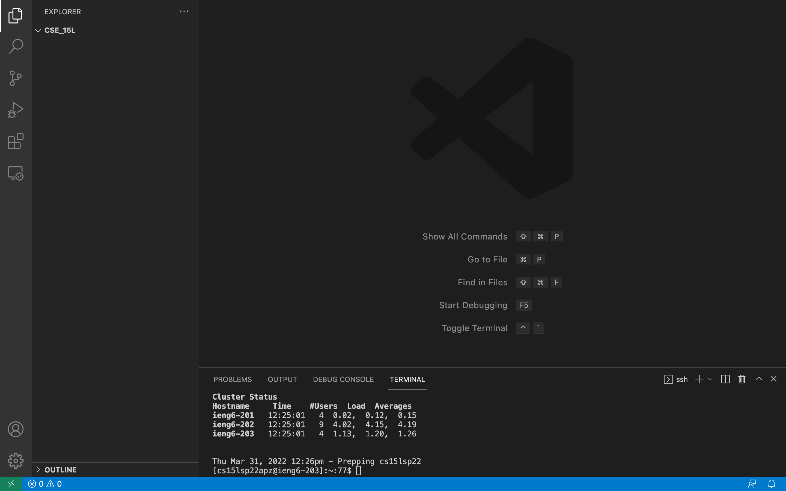

# Lab 1 Report

* Step 1: Installing VS Code

Go to VS Code's website, [Linked Here](https://code.visualstudio.com/), and follow the instructions for how to download and install the application on your computer.
Once you've installed it you can open VS Code and it will look like this.

* Step 2: Remotely Connecting

Once VS Code is installed you will want to connect to a remote computer from your personal computer. Now you'll want to open VS Code.

 Note: if you're using Windows the first thing you want to do is install OpenSSH at this [link](https://docs.microsoft.com/en-us/windows-server/administration/openssh/openssh_install_firstuse). Once that is done you can open VS Code and continue with the following steps.

From VS Code you'll want to open a new terminal using the menu option. From the terminal you use the command `ssh cs15lsp22zz@ieng6.ucsd.edu` where 'zz' is replaced by your three letters in your course specific account (you can find your course specific account [here](https://sdacs.ucsd.edu/~icc/index.php)). This is the command for connecting the remote computer. The first time you try to connect you will see a message that looks like this 

"⤇ ssh cs15lsp22zz@ieng6.ucsd.edu

The authenticity of host 'ieng6.ucsd.edu (128.54.70.227)' can't
be established.

RSA key fingerprint is
SHA256:ksruYwhnYH+sySHnHAtLUHngrPEyZTDl/1x99wUQcec.

Are you sure you want to continue connecting
(yes/no/[fingerprint])?"

type "yes" and hit enter and you'll see this.

