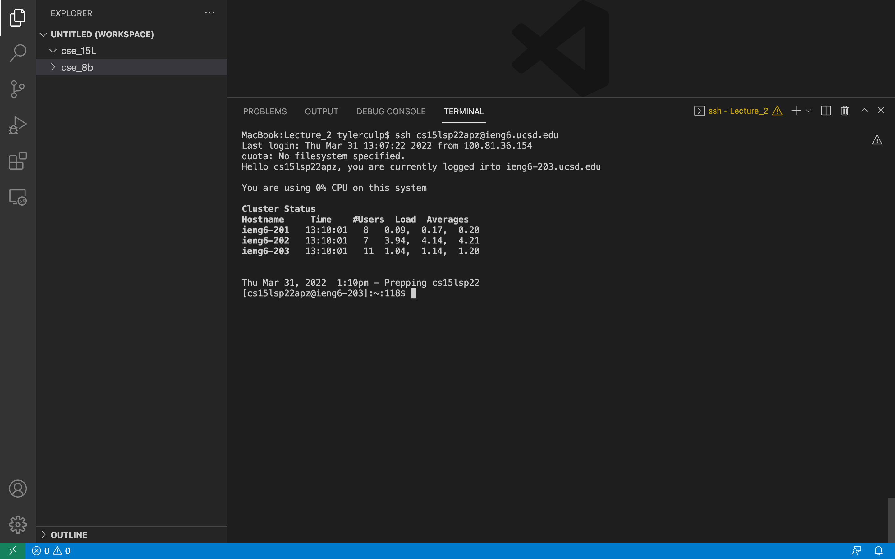
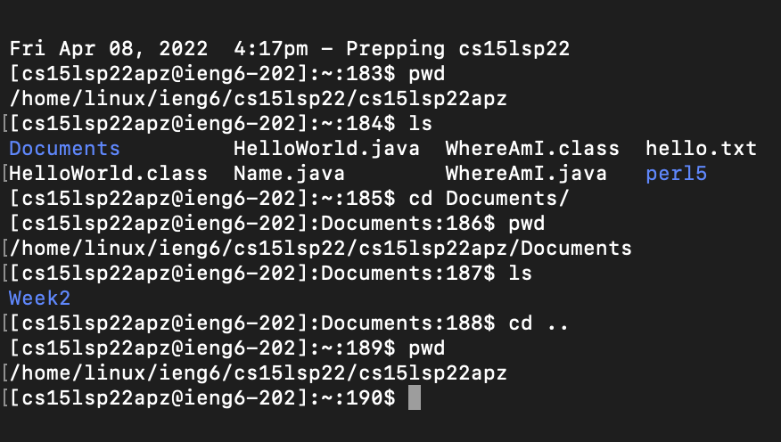
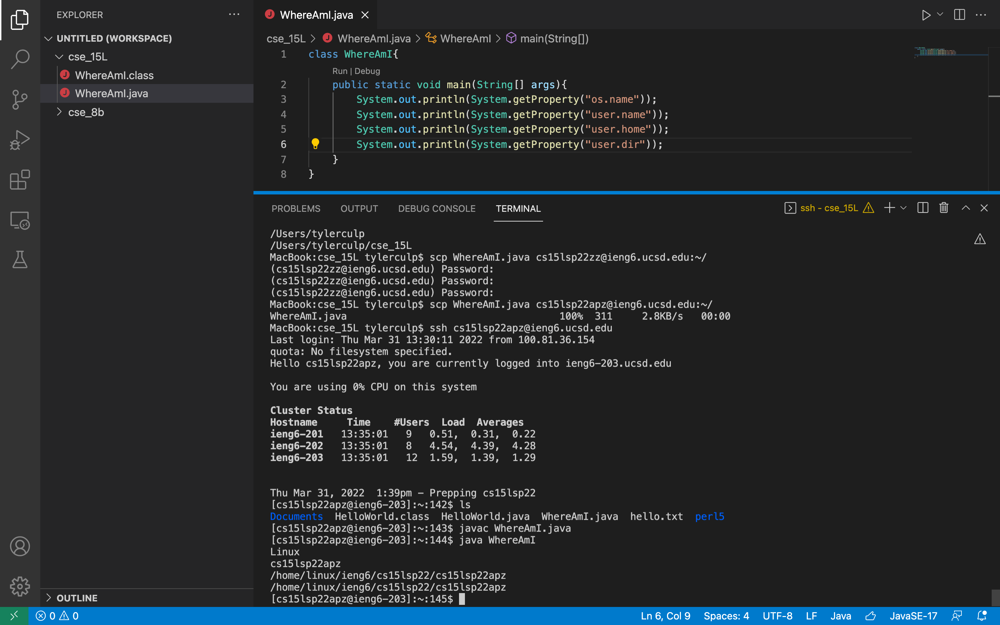
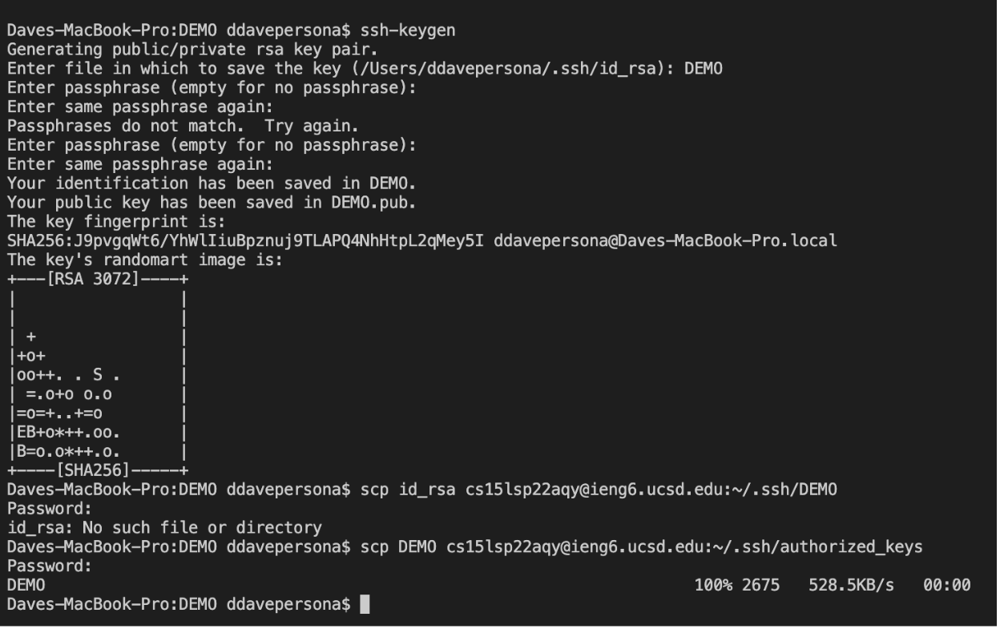
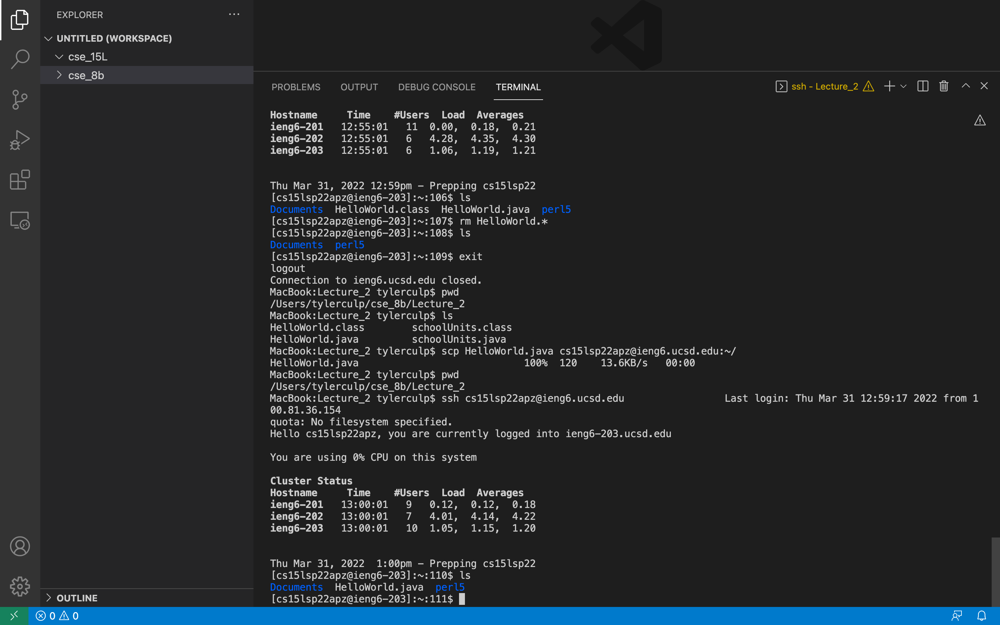

# Lab 1 Report

* Step 1: Installing VS Code

I went to VS Code's website, [Linked Here](https://code.visualstudio.com/), and followed the instructions for how to download and install the application on my computer.
Once I installed it I was able to open VS Code, which looks like this.

* Step 2: Remotely Connecting

Once VS Code was installed I wanted to connect to a remote computer from my personal computer.

 Note: if you're using Windows the first thing you want to do is install OpenSSH at this [link](https://docs.microsoft.com/en-us/windows-server/administration/openssh/openssh_install_firstuse). Once that is done you can open VS Code and continue with the following steps.

From VS Code I opened a new terminal using the menu option. From the terminal I used the command `ssh cs15lsp22zz@ieng6.ucsd.edu` where 'zz' is replaced by my three specific letters from my course account (I found the letters for my account [here](https://sdacs.ucsd.edu/~icc/index.php)). This is the command for connecting the remote computer. The first time I connected I saw a message that looks like this:

`⤇ ssh cs15lsp22zz@ieng6.ucsd.edu`

`The authenticity of host 'ieng6.ucsd.edu (128.54.70.227)' can't`
`be established.`

`RSA key fingerprint is`
`SHA256:ksruYwhnYH+sySHnHAtLUHngrPEyZTDl/1x99wUQcec.`

`Are you sure you want to continue connecting`
`(yes/no/[fingerprint])?"`

type `yes` and hit enter and you'll see this.

* Step 3: Running commands

Now that I was connected to the remote computer I tried running some commands in the terminal. These commands might include:

1. cd : Change directory
2. ls : List files in the current directory
3. touch : To creat a new file
4. pwd : Show the working directory
5. mkdir : Make a new directory

* Step 4: Moving files with scp

Now that I had connected to the remote system I was able to move files from my personal computer over to the remote one using the `scp` command. By typing

`scp [File Name] cs15lsp22zz@ieng6.ucsd.edu:~/`

you can copy the file into a directory on the remote system. This file can be accessed from the remote system once you sign into it. An example of this can be seen with the WhereAmI java file in the screenshot below.

* Step 5: Setting an SSH Key

Connecting to ssh and using scp can start to become a pain with having to enter your password everytime. To get around this I created a SSH Key that would allow me to bypass the required password everytime. I did this by using `ssh-keygen` to create a public and private key. This is what making these keys looks like in the terminal

* Step 6: Optimizing Remote Running

Now that I had my ssh keys set up I was able to connect to the remote system or copy over files in just a couple of keystrokes. This made logging in take only a couple of seconds, especially if I already had the ssh command in my terminal from earlier so that I could just use the up arrow on my computer to bring it back up. The screenshot below shows me copying files over and logging into the remote system much more effeciently now that I had my keys set up.

