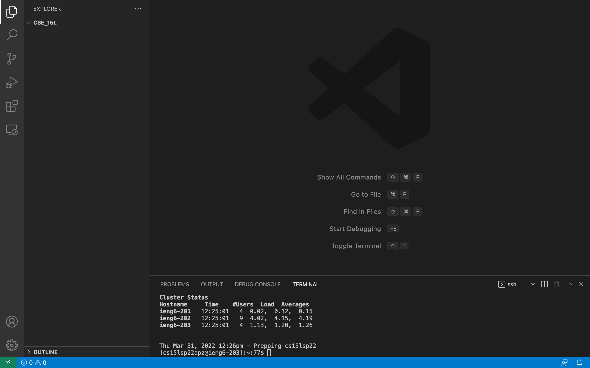

# Lab 1 Report

* Step 1: Installing VS Code

Go to VS Code's website, [Linked Here](https://code.visualstudio.com/), and follow the instructions for how to download and install the application on your computer.
Once you've installed it you can open VS Code and it will look like this.

