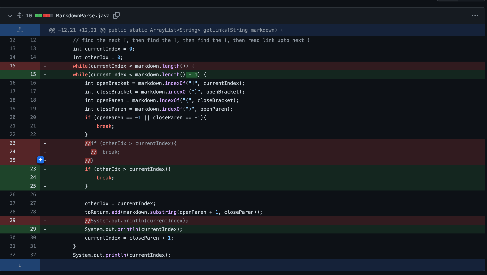
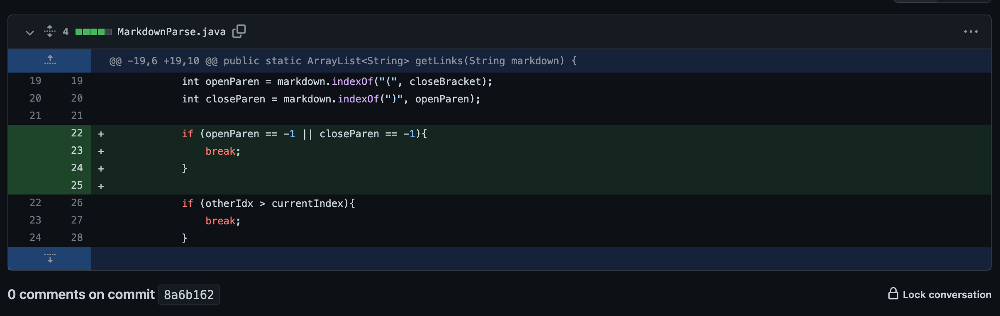
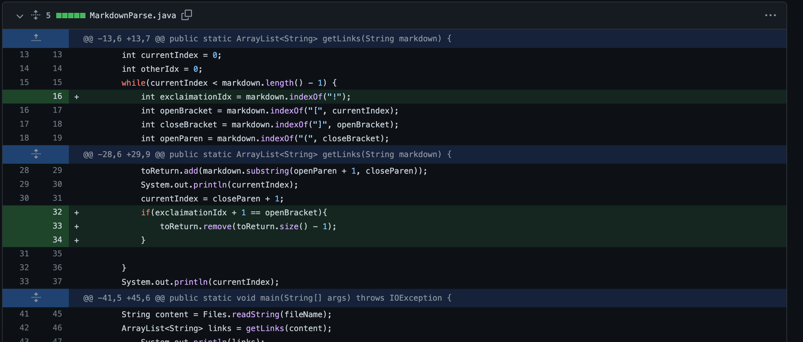

1.

The first change in the code was implimented to try and fix the problems that the extra empty line at the end of [test-file.md](test-file.md) was causing. It caused an infinite loop so the command line just kept repeating the same two index numbers from the print statements we had added to it (there was no command line error other than these repeating numbers). The bug here was the fact that the code had no way of handling an extra empty line. The failure inducing input is adding one or more of these blank lines and the symptom that this failure inducing input causes is an infinite loop.

2.

The second change in the code was done in order to fix the case where there were no links in the file to begin with (i.e. no parenthesis) and was done in response to this [file](break-file.md). This is the symptom of the failure inducing input:

 `Exception in thread "main" java.lang.StringIndexOutOfBoundsException: Range [0, -1) out of bounds for length 36
        at java.base/jdk.internal.util.Preconditions$1.apply(Preconditions.java:55)`
    
 This code checks to make sure there are any parenthesis in the test file to begin with. The bug in the original code is that there were no checks for whether or not parenthesis actually existed within the file and the failure indicing input was giving the parser a file that had no links (and thus no parenthesis) in it. The symptom of that is the index out of bounds exception that you see above

3.

This last change was made to make sure the parser wasn't trying to add image links to the list as well. The test file that prompted me to make this change has one imgage link and one regular link and can be found [here](break-file3.md). Theoutput of the code before making this edit for this test file was:

`MacBook:markdown-parser tylerculp$ java MarkdownParse break-file3.md
0
30
68
[someLink.com, picture.url.com]`

The bug here was that the parser originally had now way to tell the difference between a website link and an image link, meaning that a failure inducing input was any file that contained pictures. This failure inducing input caused the symptom of too many links being added to the list. 

