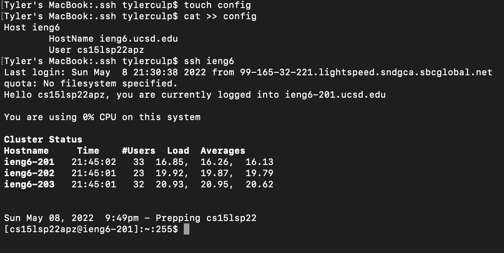
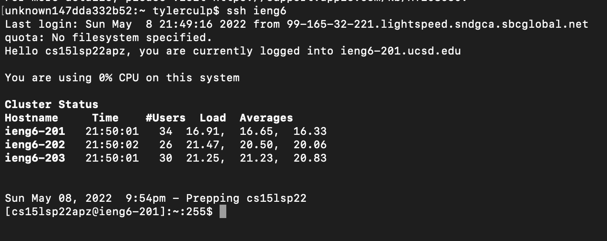
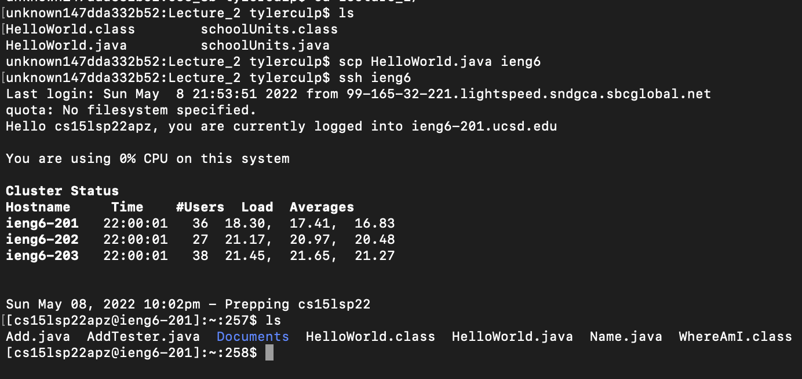
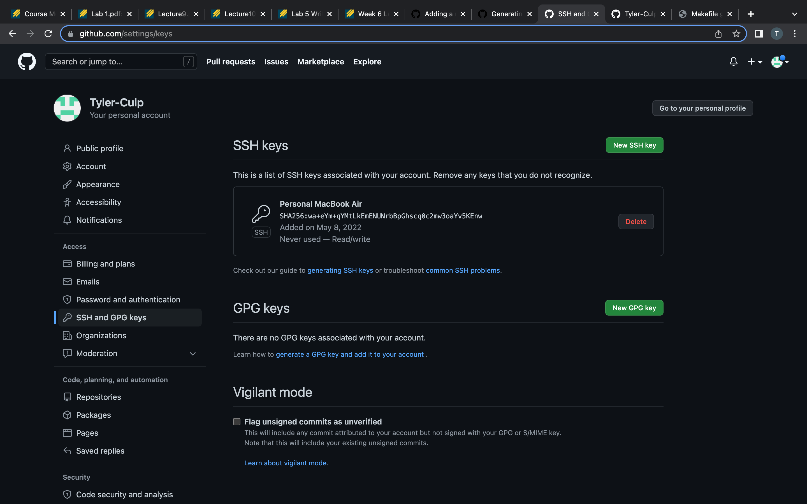
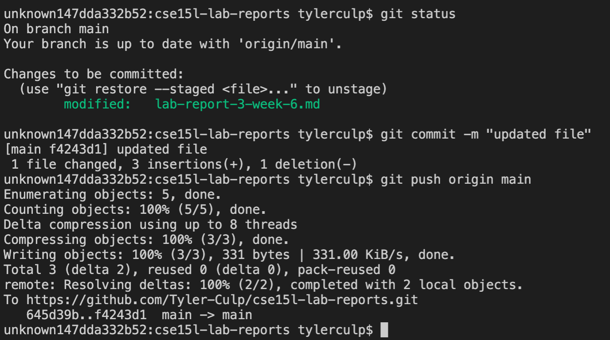
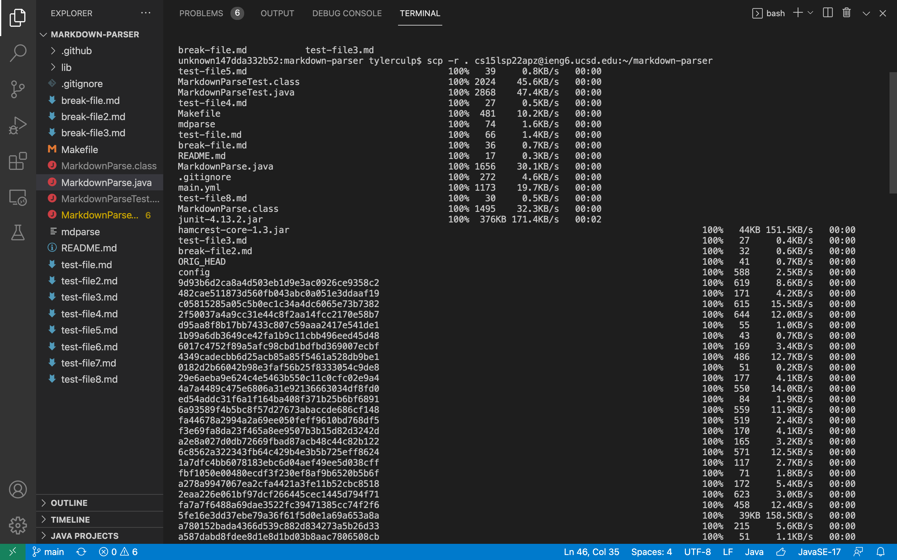
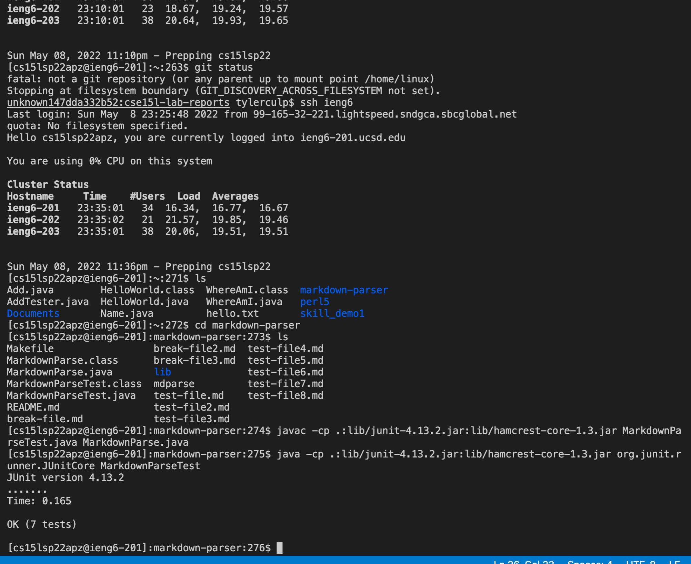
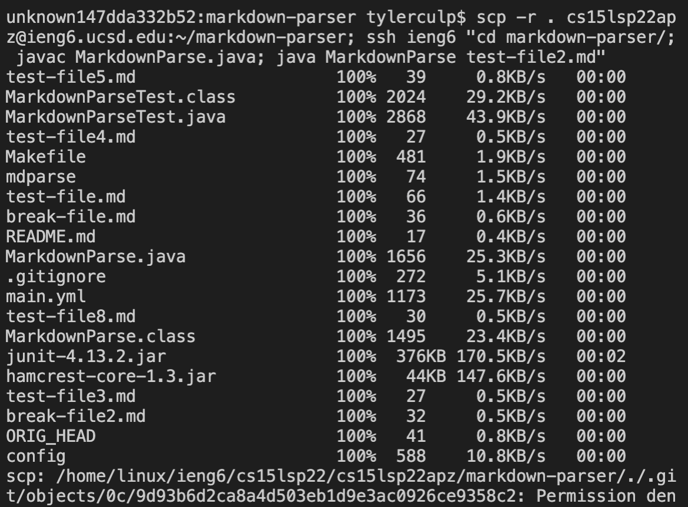

# Streamlining ssh Configuration

The first thing I did to steamline the ssh process is to create a config file. I created and edited this file just through my terminal on my mac.

The screenshot below shows me logging into the server using just `ssh ieng6`. 

In this next screenshot you can also see how much easier it is to scp files now that tis config file is set up. Now I only need to do `scp [filename] ieng6` to copy files over to the server. The screenshot below shows me doing this.

# Setup Github Access from ieng6

Now we will look at ssh keys added to github. Below shows where the key is stored for me on github:

And this shows me commiting and pushing my changes to github from my terminal:

and here is the [link](https://github.com/Tyler-Culp/cse15l-lab-reports/commit/f4243d1f70d35178594238009d671dcd834ba83c) for the last commit.

# Copy whole directories with scp -r

We can copy over whole directories to our ieng6 accounts with scp by using `scp -r . cs15lsp22apz@ieng6.ucsd.edu:~/[directory_name]` as shown below using the markdownParser directory:

The next screenshot shows me accessing my ssh account and going into the markdownParser directory that is now there, and then running my JUnit tests from the ieng6 account:

Finally this last screen shot shows me combining scp with ssh to be able to copy the directory and run a test with markdownparser all on a single line.

