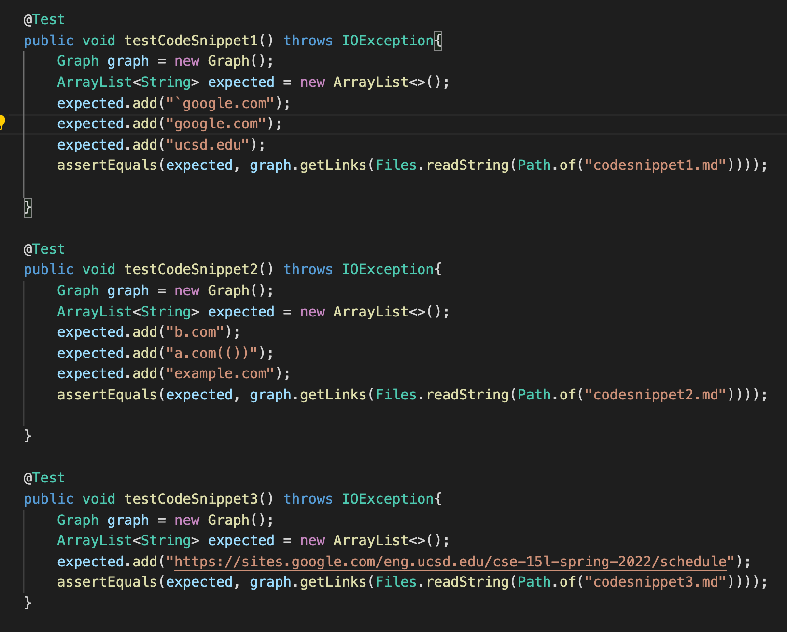
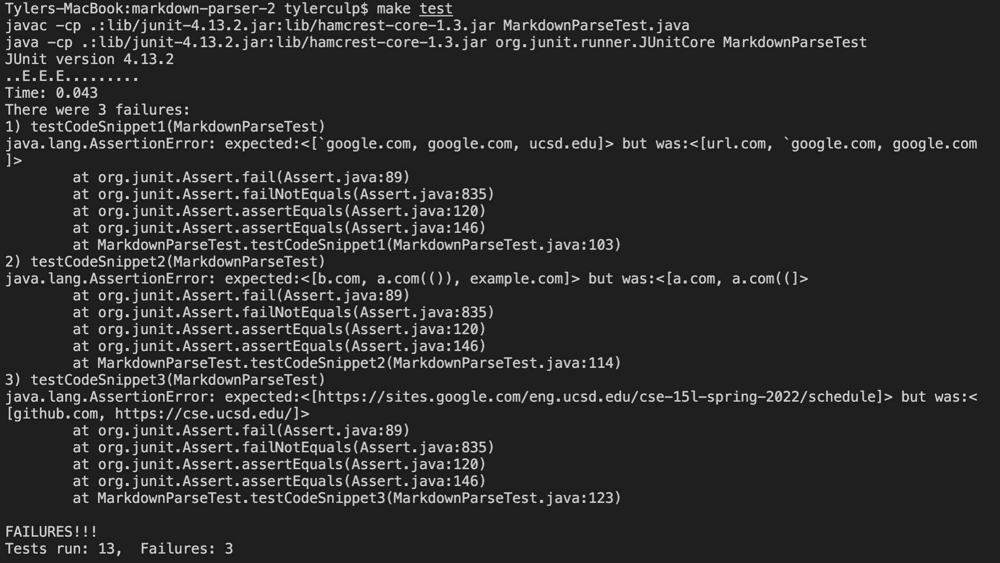
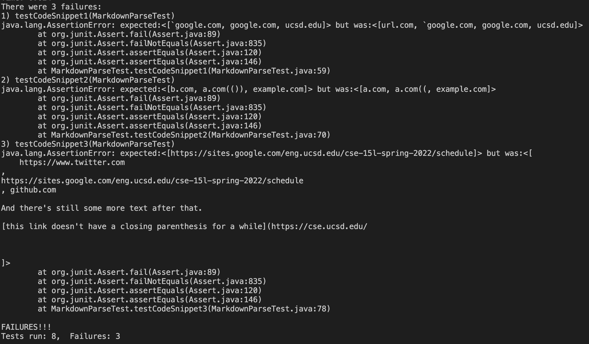

Here are the links to the two repositories that were used in this lab report:

1. Our repo: https://github.com/Combobyte/markdown-parser
2. Their repo: https://github.com/nquach1515/markdown-parser-cse15l

The markdown parsers should produce:

* Snippet 1: [`google.com, google.com, ucsd.edu]
* Snippet 2: [b.com, a.com(()), example.com]
* Snippet 3: [https://sites.google.com/eng.ucsd.edu/cse-15l-spring-2022/schedule]

Here is the code that shows how I added the tests the the MarkdownParseTest.java file:

Here is a picture that shows the results after I ran those tests, none of which our code actually passed:

And here is a picture of the result of running the same tests againsts the other group's code (their code also didn't pass any of the new tests):

## Fixing the parsers:

* Snippet 1: For this first snippet I do think that there is a small code change we could make to fix the issues. I think we could fix this problem by keeping track of the backtics the same way we kept track of the brackets and parenthesis. From there we could add an if statememnt to check if brackets or parenthesis are between backtics to get it to give the correct output.

* Snippet 2: 

