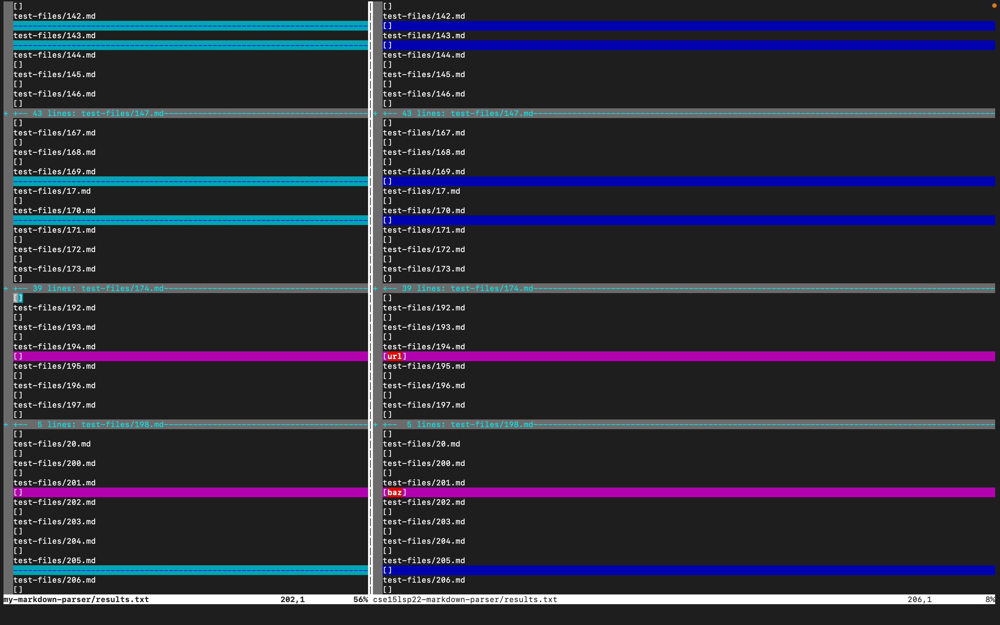
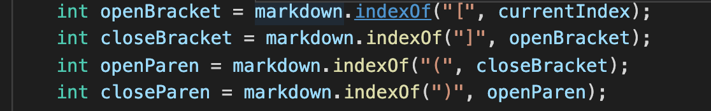

Two of the tests that gave different results between the two markdown parsers were test 194 and test 201. In both of these tests my markdown parser returned nothing while the other parser returned one url in each test. The way I was able to quickly find tests that gave different inputs was by using vimdiff.

Here are the links to the two different test files:

* [Test 194](https://github.com/nidhidhamnani/markdown-parser/blob/main/test-files/194.md)
* [Test 201](https://github.com/nidhidhamnani/markdown-parser/blob/main/test-files/201.md)

For test 194 the correct implementation is my parser which returns no links meaning that the expected output is []. For test 201 I  think the other implementation is correct, meaning that the expected output is [baz]. Here are the two different outputs are shown with vimdiff:

Based on the common mark demo site the output it should produce for test 194 is [] and the output is should produce for test 201 is [baz].

I think that bug in my code causing the problem when we try test 201 is the fact that there is no real part addressing mulitline links that are created using colons. My markdown parser only just checks if there is a bracket pair and parenthesis pair set up such that the closed bracket is right next to the open paranethesis meaning that it will never catch multi lined links. 

To fix the issue my code has with test 201's input I think that we would need to add another line of code to the block above that will also keep track of the index of any colons. With that we can then determine if we have a multi line link and figure out a way to find the link attatched that way.